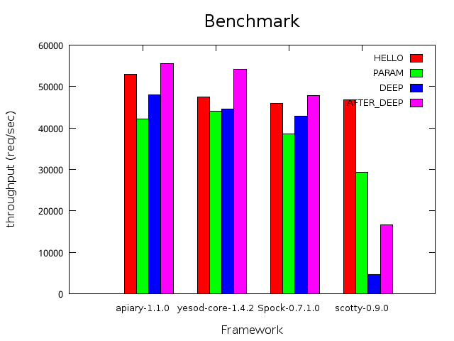

apiary-benchmark
===
benchmark result of haskell lightweight web frameworks.

Frameworks
---
* [apiary](src/apiary.hs)
* [scotty](src/scotty.hs)
* [Spock](src/Spock.hs)
* [yesod](src/yesod.hs)

How to run
---
```.sh
cabal update
cabal sandbox init
cabal get apiary-1.0.0 Spock-0.7.0.0 scotty-0.9.0 yesod-core-1.4.1.1
cabal install ./apiary-1.0.0 ./Spock-0.7.0.0 ./scotty-0.9.0 ./yesod-core-1.4.1.1
./scripts/all.sh apiary-1.0.0 Spock-0.7.0.0 scotty-0.9.0 yesod-core-1.4.1.1
```

Benchmarks
---
1. HELLO (no capture)
2. PARAM (capture route parameter)
3. DEEP  (deep and many routes)
3. AFTER_DEEP (after DEEP route)

Machines
---

### server1

```.sh
% uname -a
Linux server1 3.2.0-4-amd64 #1 SMP Debian 3.2.57-3+deb7u2 x86_64 GNU/Linux
% cat /proc/cpuinfo | grep 'model name'
model name	: Intel(R) Core(TM) i3-2120T CPU @ 2.60GHz
model name	: Intel(R) Core(TM) i3-2120T CPU @ 2.60GHz
model name	: Intel(R) Core(TM) i3-2120T CPU @ 2.60GHz
model name	: Intel(R) Core(TM) i3-2120T CPU @ 2.60GHz
% cat /proc/meminfo | grep MemTotal
MemTotal:       16354960 kB
```

Results
---

### single thread


|machine  |ghc    |framework       |HELLO   |PARAM   |DEEP    |AFTER_DEEP|
|---------|-------|----------------|--------|--------|--------|----------|
|server1  |7.8.3  |apiary-1.1.0    |34345.51|27669.10|31875.68|36617.01  |
|server1  |7.8.3  |yesod-core-1.4.2|32333.69|27403.80|27218.26|34324.26  |
|server1  |7.8.3  |Spock-0.7.1.0   |28715.47|24018.31|26427.82|29233.87  |
|server1  |7.8.3  |scotty-0.9.0    |29109.18|17685.93|2567.70 |9584.23   |

### multi thread (N=2)



|machine  |ghc    |framework       |HELLO   |PARAM   |DEEP    |AFTER_DEEP|
|---------|-------|----------------|--------|--------|--------|----------|
|server1  |7.8.3  |apiary-1.1.0    |52979.08|42223.51|48035.72|55465.71  |
|server1  |7.8.3  |Spock-0.7.1.0   |45877.13|38619.74|42809.85|47817.24  |
|server1  |7.8.3  |yesod-core-1.4.2|47527.36|44009.62|44557.05|54162.44  |
|server1  |7.8.3  |scotty-0.9.0    |46723.73|29256.40|4712.02 |16557.31  |

References
---
1. [agrafix/Spock-scotty-benchmark](https://github.com/agrafix/Spock-scotty-benchmark)
