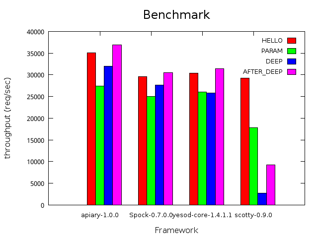

benchmark
===
benchmark result of haskell lightweight web frameworks.

libraries
---
* apiary
* scotty
* Spock

how to run
---
```.sh
cabal update
cabal sandbox init
cabal install -fapiary -fSpock -fscotty --only-dependencies
./scripts/all.sh apiary-0.16.0 Spock-0.6.3.0 scotty-0.9.0
```

benchmarks
---
1. HELLO (no capture)
2. PARAM (capture route parameter)
3. DEEP  (deep and many routes)
3. AFTER_DEEP (after DEEP route)

machines
---

### machine1

```.sh
% uname -a
Linux server1 3.2.0-4-amd64 #1 SMP Debian 3.2.57-3+deb7u2 x86_64 GNU/Linux
% cat /proc/cpuinfo | grep 'model name'
model name	: Intel(R) Core(TM) i3-2120T CPU @ 2.60GHz
model name	: Intel(R) Core(TM) i3-2120T CPU @ 2.60GHz
model name	: Intel(R) Core(TM) i3-2120T CPU @ 2.60GHz
model name	: Intel(R) Core(TM) i3-2120T CPU @ 2.60GHz
% cat /proc/meminfo | grep MemTotal
MemTotal:       16354960 kB
```

results
---

### single thread



|machine  |ghc    |framework    |HELLO   |PARAM   |DEEP    |AFTER_DEEP|
|---------|-------|-------------|--------|--------|--------|----------|
|server1  |7.8.2  |scotty-0.9.0 |26732.46|15334.90|2617.78 |8970.98   |
|server1  |7.8.2  |apiary-0.16.0|33191.55|26526.21|30126.96|35459.68  |
|server1  |7.8.2  |Spock-0.6.3.0|24394.24|19615.80|20726.95|26112.09  |

references
---
1. [agrafix/Spock-scotty-benchmark](https://github.com/agrafix/Spock-scotty-benchmark)
